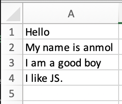
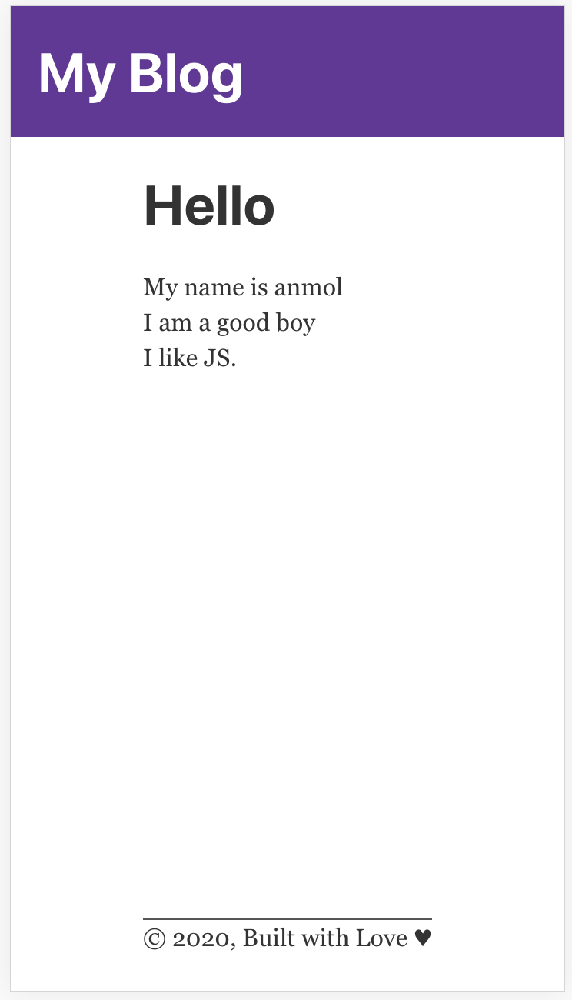

## 🚀 Quick start
Clone the repo and run `npm i` to install all the packages and then run `npm run develop` to start the site locally.

## What does this do?
The module works by parsing the csv and converting them to JSON files with first value in the column as section heading and all other rows as the content inside the section. It also creates a `route.json` based on the csv file name. The csv files are located inside the resources folder and the created JSONs are at `src -> data`.

Workflow:
* CSV files are located in `resources` folder. Run `npm run parse-excel` to create JSONs for all the csvs. These files are created in `src -> data`.
* Run `gatsby develop` to run the module locally. You can view the site at `localhost:8000`.
* To deploy the site using gh-pages, run `npm run deploy`

Example: demo.csv



file contents
```
Hello,
My name is anmol,
I am a good boy,
I like JS.,
```

This gets converted and to demo.json
```
[{
  title: Hello,
  content: [
    My name is anmol,
    I am a good boy,
    I like JS.
  ]
}]
```

